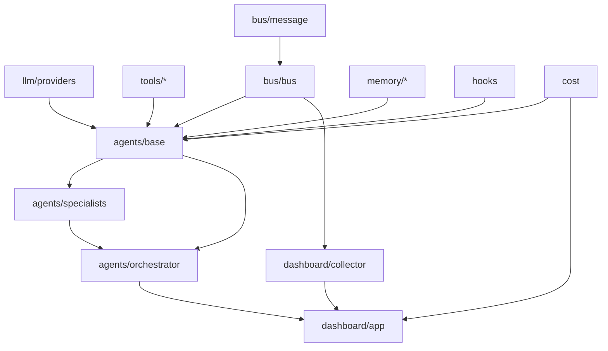

# AgentForge Architecture

> 基于 LangGraph 的多 Agent 协作框架，支持软件研发和通用任务两种协作模式。

---

## 核心设计原则

1. **状态图驱动**：所有 Agent 行为通过 LangGraph StateGraph 建模——节点是纯函数，条件边是决策点，状态通过 reducer 自动合并
2. **消息解耦**：Agent 之间通过 Message Bus（发布-订阅）通信，发送方不知道接收方是谁，支持零成本扩展新 Agent
3. **分层记忆**：短期记忆（滑动窗口 + 摘要压缩）控制上下文长度，长期记忆（JSON 键值 + 关键词检索）跨会话持久化
4. **全链路可观测**：Bus 事件 + 生命周期 Hooks + Token 成本追踪，每一步决策、每次工具调用都可追溯

---

## 模块架构

```
agent_forge/
├── llm/                  # LLM Provider 工厂
│   └── providers.py      # DeepSeek（兼容 OpenAI SDK）
├── tools/                # 工具系统
│   ├── file_tools.py     # read_file / write_file
│   ├── shell_tools.py    # run_shell（黑名单 + 沙箱 + 超时 + 截断）
│   ├── search_tools.py   # grep_search
│   ├── sandbox.py        # 线程局部工作区沙箱（路径越界拒绝）
│   ├── registry.py       # ToolRegistry（三级权限：READ/WRITE/EXECUTE + 审批门）
│   └── mcp_tools.py      # MCP 工具生态接入（可选，客户端侧）
├── bus/                  # 消息总线
│   ├── message.py        # Message dataclass + MessageIntent 枚举
│   ├── bus.py            # MessageBus（pub/sub + 拦截器链 + 消息历史）
│   └── interceptors.py   # HumanApprovalInterceptor
├── agents/               # Agent 抽象层
│   ├── base.py           # BaseAgent（ReAct 循环 + Bus 集成 + Hooks + CostTracker
│   │                     #   + 死循环兜底四件套：max_turns 上限/同参拦截/失败熔断/兜底输出）
│   ├── specialists.py    # CoderAgent / ReviewerAgent / AnalystAgent / WriterAgent
│   └── orchestrator.py   # Orchestrator（Plan-and-Execute + 审查回退）
├── memory/               # 记忆系统
│   ├── short_term.py     # ShortTermMemory（滑动窗口 + LLM 摘要压缩）
│   ├── long_term.py      # LongTermMemory（JSON key-value 持久化）
│   └── session.py        # SessionManager（自动保存/加载）
├── dashboard/            # 可视化 Dashboard
│   ├── collector.py      # BusCollector（订阅 Bus 采集事件，线程安全）
│   ├── app.py            # Streamlit 应用（4 Tab：任务/消息流/状态/成本）
│   └── approval.py       # 人工审批门（HITL：run_shell 执行前批准/拒绝）
├── hooks.py              # HookManager（4 个标准事件钩子）
├── cost.py               # CostTracker（按 Agent 维度汇总 Token 成本）
└── utils.py              # safe_print / atomic_write_text / print_*
```

### 模块依赖关系



---

## 数据流

```
用户输入
    │
    ▼
Orchestrator（Plan-and-Execute）
    │
    ├── 1. decompose_node: LLM 拆解任务为子任务列表
    ├── 2. execute_node: 路由到 Specialist Agent
    │       │
    │       ├── Coder Agent（ReAct 循环）
    │       │     ├── agent_node: LLM 推理
    │       │     ├── tool_node: 执行工具（read_file / write_file / run_shell）
    │       │     └── should_continue: 循环保护（max_turns + 循环检测 + 失败熔断）
    │       │
    │       └── Reviewer Agent（ReAct 循环）
    │             ├── agent_node: LLM 推理
    │             └── tool_node: read_file 审查代码
    │
    ├── 3. review_node: 审查判定（通过 → aggregate，不通过 → 回退 execute）
    └── 4. aggregate_node: 汇总所有产出 → 最终报告

    全程事件发布到 MessageBus
    │
    ├── LoggingInterceptor: 终端实时打印
    ├── BusCollector: 结构化存储（Dashboard 数据源）
    └── CostTracker: Token 成本采集
```

---

## 消息协议

### Message dataclass

| 字段 | 类型 | 说明 |
|------|------|------|
| `role` | `str` | 发送方 Agent 标识 |
| `intent` | `MessageIntent` | 消息意图（见下表） |
| `payload` | `dict[str, Any]` | 消息内容 |
| `metadata` | `dict[str, Any]` | 附加元数据 |
| `message_id` | `str` | UUID4（自动填充） |
| `timestamp` | `float` | Unix 时间戳（自动填充） |
| `reply_to` | `str \| None` | 关联的 REQUEST message_id |

### MessageIntent 枚举

| 值 | 用途 |
|----|------|
| `REQUEST` | 请求执行任务，期望收到 RESPONSE |
| `RESPONSE` | 对 REQUEST 的回复 |
| `BROADCAST` | 通知所有 Agent |
| `EVENT` | 系统级事件（agent.started / tool_request 等） |
| `HEARTBEAT` | Agent 存活检测（预留） |

---

## 事件体系

Agent 通过 Bus 发布 EVENT 消息，payload 中的 `event_type` 标识事件类型：

### Agent 生命周期事件

| event_type | 触发时机 | payload 关键字段 |
|------------|---------|-----------------|
| `agent.started` | Agent 开始处理 | `user_input` |
| `agent.thinking` | LLM 推理中 | — |
| `agent.tool_request` | 请求调用工具 | `tool_name`, `tool_args` |
| `agent.tool_result` | 工具调用结果 | `tool_name`, `result_preview` |
| `agent.completed` | Agent 完成处理 | `result` |

### Orchestrator 编排事件

| event_type | 触发时机 | payload 关键字段 |
|------------|---------|-----------------|
| `orchestrator.started` | 编排开始 | `task` |
| `orchestrator.decomposing` | 任务拆解中 | `task` |
| `orchestrator.dispatching` | 分发子任务 | `step`, `total`, `target_agent` |
| `orchestrator.reviewing` | 审查中 | `retry_count` |
| `orchestrator.aggregating` | 汇总产出 | — |
| `orchestrator.completed` | 编排完成 | `result_preview` |

### 生命周期 Hooks（HookManager）

| Hook 事件 | 触发时机 | kwargs |
|-----------|---------|--------|
| `pre_llm_call` | LLM 调用前 | `agent`, `messages` |
| `post_llm_call` | LLM 调用后 | `agent`, `response` |
| `pre_tool_use` | 工具执行前 | `agent`, `tool_name`, `tool_args` |
| `post_tool_use` | 工具执行后 | `agent`, `tool_name`, `output` |

---

## 快速开始

```bash
# 1. 配置环境
cp .env.example .env
# 编辑 .env，填入 DEEPSEEK_API_KEY

# 2. 安装依赖
uv pip install -e .
uv pip install -e ".[dashboard]"  # 如果需要 Dashboard

# 3. 运行 Demo
python demos/phase0_agent_demo.py --step 2   # 单 Agent ReAct 循环
python demos/phase1_agent_demo.py --step 2   # BaseAgent + Message Bus
python demos/phase2_agent_demo.py --step 3   # Orchestrator 编排
python demos/phase3_agent_demo.py --step 3   # 记忆 + 权限 + Hooks
python demos/phase4_demo.py --step 3         # Streamlit Dashboard

# 4. 直接启动 Dashboard
streamlit run agent_forge/dashboard/app.py
```

---

## 技术决策记录

| ADR | 标题 |
|-----|------|
| [001](docs/adr/001-choose-langgraph.md) | 为什么选 LangGraph |
| [002](docs/adr/002-message-bus-design.md) | 消息总线设计：Pub/Sub vs 点对点 |
| [003](docs/adr/003-orchestrator-design.md) | Orchestrator 设计：Plan-and-Execute + 审查回退 |
| [004](docs/adr/004-tool-permissions.md) | 工具权限分级设计 |
| [005](docs/adr/005-mcp-tool-ecosystem.md) | MCP 工具生态接入 |

---

## 技术栈

| 层面 | 选择 |
|------|------|
| 语言 | Python 3.11+ |
| Agent 框架 | LangGraph（状态机驱动） |
| LLM | DeepSeek V4-Flash（兼容 OpenAI SDK） |
| 工具系统 | LangChain @tool + ToolRegistry |
| 前端 | Streamlit |
| 依赖管理 | uv + pyproject.toml |

---

> 最后更新：2026-09-29（specialists 补齐 4 个 Agent；兜底四件套与 README/AGENTS.md 统一口径）
