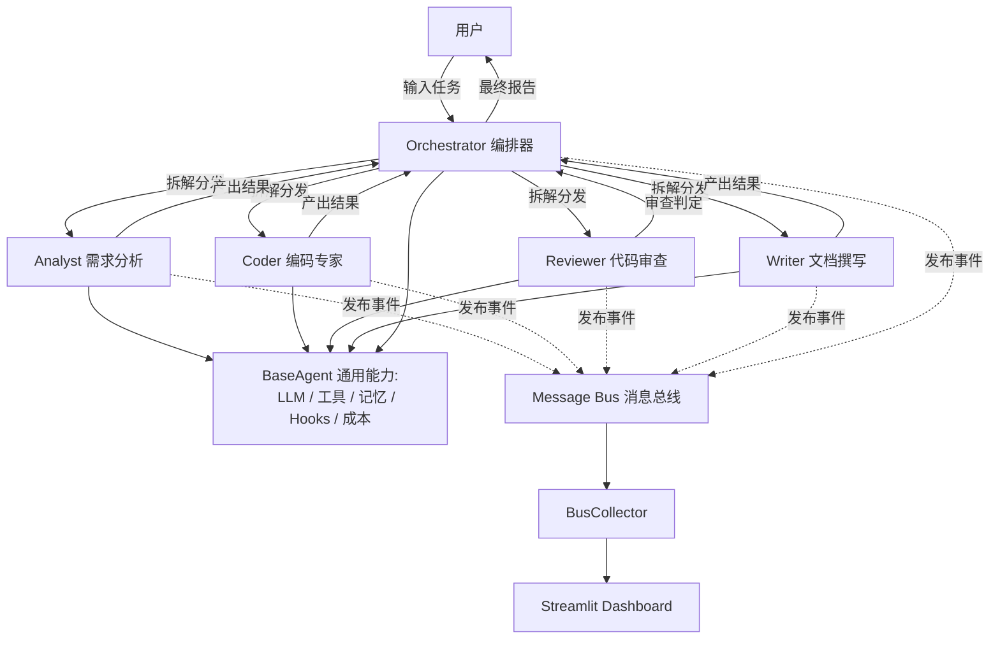
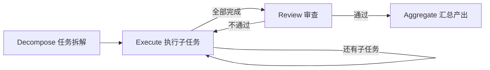

# AgentForge

[](https://github.com/yyc2417/agent-forge/actions/workflows/ci.yml)

> 基于 LangGraph 的多 Agent 协作框架 —— 锻造和编排各种专业 AI Agent

一个可演示、可扩展的多 Agent 协作框架，支持**软件开发**和**通用任务**两种场景。通过状态图驱动的编排引擎、发布-订阅消息总线和分层记忆系统，实现多 Agent 的动态协作。

## 架构概览



## 编排工作流

Orchestrator 使用 LangGraph StateGraph 建模任务编排流程，同一引擎支持不同场景的 Agent 组合：



不同场景通过配置不同的 Specialist 组合来实现：

| 场景 | Agent 组合 | 说明 |
|------|-----------|------|
| 软件研发 | Analyst → Coder → Reviewer | 需求分析 → 编码实现 → 代码审查（不通过自动回退重写） |
| 研究报告 | Analyst → Coder → Writer | 调研框架 → 信息搜集 → 撰写报告文件 |

## 核心设计

| 模块 | 设计 | 关键技术 |
|------|------|----------|
| **Agent 抽象** | BaseAgent 模板方法模式 + 死循环兜底（循环检测/失败熔断/兜底输出） | LangGraph StateGraph, ReAct 循环 |
| **消息总线** | Pub/Sub 发布-订阅，Agent 间解耦通信 | 多维路由（intent/role/wildcard）, 拦截器链 |
| **编排引擎** | Plan-and-Execute + 审查回退的混合模式 | 条件边, 状态机, LLM 任务拆解 |
| **分层记忆** | 短期（滑动窗口+摘要压缩）+ 长期（JSON 持久化）+ 会话管理 | 自动保存/加载 |
| **工具系统** | 三级权限模型（READ/WRITE/EXECUTE）+ 审批门 + 沙箱 + MCP 生态 | @tool 装饰器, Function Calling, MCP |
| **可观测性** | BusCollector 事件采集 + Streamlit 4-Tab Dashboard | 线程安全, 实时刷新 |
| **量化评测** | 20 个标准任务, 5 种评判类型, 已产出实测对比数据 | 隔离执行, 3 次取中位数 |

## 实测数据：单 Agent vs 多 Agent

用框架自带的评测系统实测（20 任务 × 2 模式 × 3 次取中位数，任务级 120s 超时兜底）：

| 指标 | 单 Agent | 多 Agent |
|------|---------|---------|
| 成功率 | **18/20 (90%)** | 17/20 (85%) |
| 平均耗时 | 15.3s | 56.3s |
| 平均 Token | 22,257 | 77,777 |

**发现：easy 任务上多 Agent 是负收益**（成功率反降、成本约 10 倍）；编排的价值区间在更复杂的场景。完整数据、失败案例分析与局限声明见 [docs/benchmark-results.md](docs/benchmark-results.md)。

## 快速开始

```bash
# 1. 配置环境
cp .env.example .env
# 编辑 .env，填入 DeepSeek API Key（获取地址：https://platform.deepseek.com/api_keys）

# 2. 安装依赖
uv pip install -e .

# 3. 运行 Demo（每个 Demo 都是三步渐进式：--step 1/2/3）
python demos/phase0_agent_demo.py --step 2   # 单 Agent ReAct 循环
python demos/phase2_agent_demo.py --step 3   # Orchestrator 多 Agent 编排
python demos/phase4_demo.py --step 3         # Streamlit Dashboard

# 多场景工作流
python demos/dev_workflow.py                 # 软件研发：Analyst → Coder → Reviewer
python demos/research_workflow.py            # 研究报告：Analyst → Coder → Writer

# 启动 Dashboard GUI
uv pip install -e ".[dashboard]"
streamlit run agent_forge/dashboard/app.py
```

## 项目结构

```
agent_forge/                  # 核心库
├── llm/                      # LLM Provider 工厂（DeepSeek / OpenAI 兼容）
├── agents/                   # Agent 抽象层
│   ├── base.py               #   BaseAgent（ReAct 循环 + Bus 集成）
│   ├── specialists.py        #   Coder / Reviewer / Analyst / Writer
│   └── orchestrator.py       #   Orchestrator（StateGraph 编排）
├── bus/                      # 消息总线
│   ├── message.py            #   Message 协议（role/intent/payload）
│   ├── bus.py                #   Pub/Sub 路由 + 拦截器链
│   └── interceptors.py       #   HumanApprovalInterceptor
├── memory/                   # 分层记忆
│   ├── short_term.py         #   滑动窗口 + LLM 摘要压缩
│   ├── long_term.py          #   JSON key-value 持久化
│   └── session.py            #   会话自动保存/加载
├── tools/                    # 工具系统
│   ├── registry.py           #   ToolRegistry（三级权限 + 审批门）
│   ├── file_tools.py         #   read_file / write_file
│   ├── shell_tools.py        #   run_shell（黑名单 + 沙箱 + 超时）
│   ├── search_tools.py       #   grep_search
│   ├── mcp_tools.py          #   MCP 工具生态接入（可选 [mcp] extra）
├── dashboard/                # 可视化
│   ├── collector.py          #   BusCollector（线程安全事件采集）
│   └── app.py                #   Streamlit 4-Tab Dashboard
├── hooks.py                  # 生命周期 Hooks（4 个标准事件）
└── cost.py                   # Token 成本追踪

benchmark/                    # 量化评测框架
├── runner.py                 #   执行引擎（隔离 + 超时 + 聚合）
├── judge.py                  #   自动评判（5 种类型）
├── metrics.py                #   指标采集
├── reporter.py               #   Markdown 报告生成
└── tasks/                    #   20 个标准任务（8 easy + 8 medium + 4 hard）

tests/                        # 单元测试（190+ 用例 + GitHub Actions CI）
demos/                        # 渐进式 Demo + 多场景工作流
docs/                         # 模块文档 + ADR + 学习笔记
```

## 技术栈

| 层面 | 选择 |
|------|------|
| Agent 框架 | LangGraph（状态图驱动） |
| LLM | DeepSeek V4-Flash（兼容 OpenAI 格式） |
| 可视化 | Streamlit Dashboard |
| 测试 | pytest（190+ 用例）+ GitHub Actions CI |
| Lint | ruff |
| 依赖管理 | uv + pyproject.toml |

## 测试

```bash
# 可选：启用 MCP 工具生态
uv pip install -e ".[mcp]"
python demos/phase6_mcp_demo.py --step 1

# 快速测试（无 LLM 调用，~4 秒）
pytest tests/ -m "not slow" -v

# 全量测试（含真实 API 调用）
pytest tests/ -v

# Lint 检查
ruff check agent_forge/ tests/ benchmark/ demos/
```

## 文档

| 文档 | 内容 |
|------|------|
| [ARCHITECTURE.md](ARCHITECTURE.md) | 整体架构设计 |
| [docs/modules/](docs/modules/) | 各模块设计文档 |
| [docs/adr/](docs/adr/) | 架构决策记录（ADR，含 MCP 接入决策） |
| [docs/learning-notes/](docs/learning-notes/) | 分阶段学习笔记 |

## License

MIT
