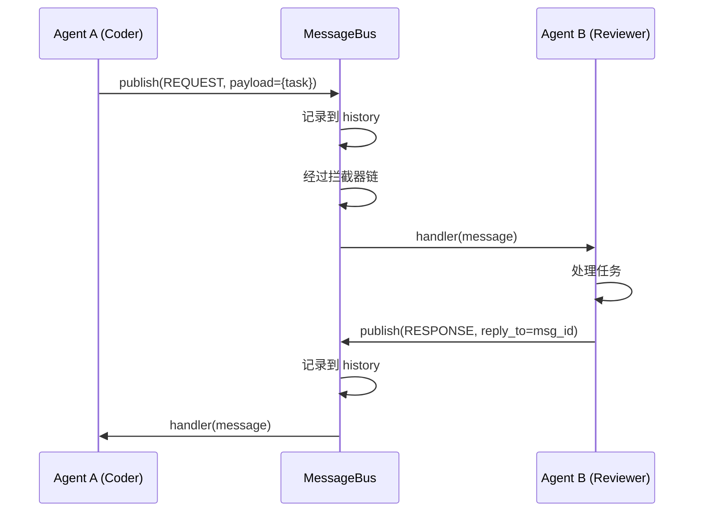

# Message Bus 模块文档

> **状态**：阶段 1初版 | **最后更新**：2026-06-07

---

## 概述

Message Bus（消息总线）是 AgentForge 多 Agent 通信的核心基础设施。所有 Agent 之间的信息传递都通过消息总线完成，而非直接调用。

这种设计借鉴了企业级系统的事件驱动架构——发送方不需要知道接收方是谁，接收方也不需要知道消息来自哪里。

---

## 消息协议

### Message 结构

每条消息都是一个 `Message` 对象，包含以下字段：

| 字段 | 类型 | 必填 | 说明 |
|------|------|------|------|
| `role` | `str` | 是 | 发送方 Agent 的唯一标识（如 `"coder"`） |
| `intent` | `MessageIntent` | 是 | 消息意图（见下表） |
| `payload` | `dict[str, Any]` | 否 | 消息的实际内容 |
| `metadata` | `dict[str, Any]` | 否 | 附加元数据 |
| `message_id` | `str` | 自动 | UUID4，全局唯一标识 |
| `timestamp` | `float` | 自动 | Unix 时间戳 |
| `reply_to` | `str \| None` | 否 | 关联的请求消息 ID |

### MessageIntent 意图类型

| 意图 | 值 | 用途 |
|------|------|------|
| `REQUEST` | `"request"` | 请求执行任务，期望收到 RESPONSE |
| `RESPONSE` | `"response"` | 对某个 REQUEST 的回复 |
| `BROADCAST` | `"broadcast"` | 通知所有 Agent（如"任务完成"） |
| `EVENT` | `"event"` | 系统级事件（如"Agent 上线"） |
| `HEARTBEAT` | `"heartbeat"` | Agent 存活检测（预留） |

### 序列化

```python
msg = Message(role="coder", intent=MessageIntent.REQUEST, payload={"task": "..."})

# 序列化
data = msg.to_dict()    # → {"role": "coder", "intent": "request", ...}

# 反序列化
msg2 = Message.from_dict(data)  # → Message(...)
```

---

## 消息总线

### Pub/Sub 路由规则

MessageBus 使用发布-订阅模式。每条消息发布时，会生成三个事件键：

```
intent.{type}    → 按意图路由（如 "intent.request"）
role.{name}      → 按角色路由（如 "role.coder"）
*                → 通配符（接收所有消息）
```

| 订阅方式 | 匹配消息 |
|----------|----------|
| `bus.subscribe("intent.request", handler)` | 所有 REQUEST 消息 |
| `bus.subscribe("role.reviewer", handler)` | reviewer 发出的所有消息 |
| `bus.subscribe("*", handler)` | 所有消息 |

### 基本用法

```python
from agent_forge.bus import MessageBus, Message, MessageIntent, LoggingInterceptor

# 创建总线
bus = MessageBus()
bus.add_interceptor(LoggingInterceptor())

# 订阅
def on_request(msg: Message):
    print(f"收到请求: {msg.payload}")

bus.subscribe("intent.request", on_request)

# 发布
bus.publish(Message(
    role="coder",
    intent=MessageIntent.REQUEST,
    payload={"task": "写一个排序函数"},
))
# 输出: [BUS]    request | coder        | {'task': '写一个排序函数'}
# 输出: 收到请求: {'task': '写一个排序函数'}
```

### 消息历史查询

```python
# 查询所有消息（最新 50 条）
history = bus.get_history(limit=50)

# 按角色过滤
coder_msgs = bus.get_history(role="coder")

# 按意图过滤
requests = bus.get_history(intent=MessageIntent.REQUEST)
```

---

## 拦截器

拦截器在消息到达订阅者之前执行，可以检查、修改或阻断消息。

```python
from agent_forge.bus import MessageInterceptor, Message

class ApprovalInterceptor(MessageInterceptor):
    """关键操作需要人工确认。"""

    def intercept(self, message: Message) -> Message | None:
        if message.payload.get("dangerous"):
            confirm = input("确认执行此操作？(y/n): ")
            if confirm != "y":
                return None  # 阻断消息
        return message  # 放行

bus.add_interceptor(ApprovalInterceptor())
```

拦截器按添加顺序执行（责任链模式）。任何一个返回 `None` 都会阻断消息。

---

## REQUEST-RESPONSE 配对

通过 `reply_to` 字段关联请求和响应：

```python
# Agent A 发出请求
request = Message(
    role="agent_a",
    intent=MessageIntent.REQUEST,
    payload={"task": "分析代码"},
)
bus.publish(request)

# Agent B 回复
response = Message(
    role="agent_b",
    intent=MessageIntent.RESPONSE,
    payload={"result": "分析完成..."},
    reply_to=request.message_id,  # 关联原始请求
)
bus.publish(response)
```

---

## 架构图



---

## 代码位置

- `agent_forge/bus/message.py` — 消息协议定义
- `agent_forge/bus/bus.py` — 消息总线实现
- `agent_forge/bus/__init__.py` — 模块导出
- `demos/phase1_agent_demo.py` — 三步演示

---

> **最后更新**：2026-06-07
